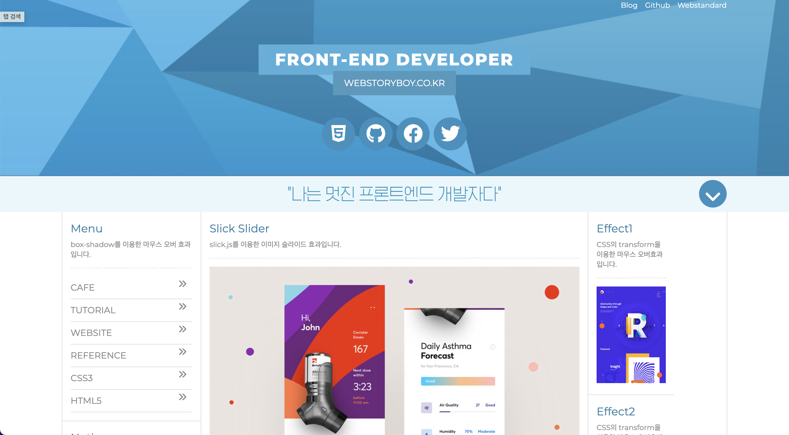
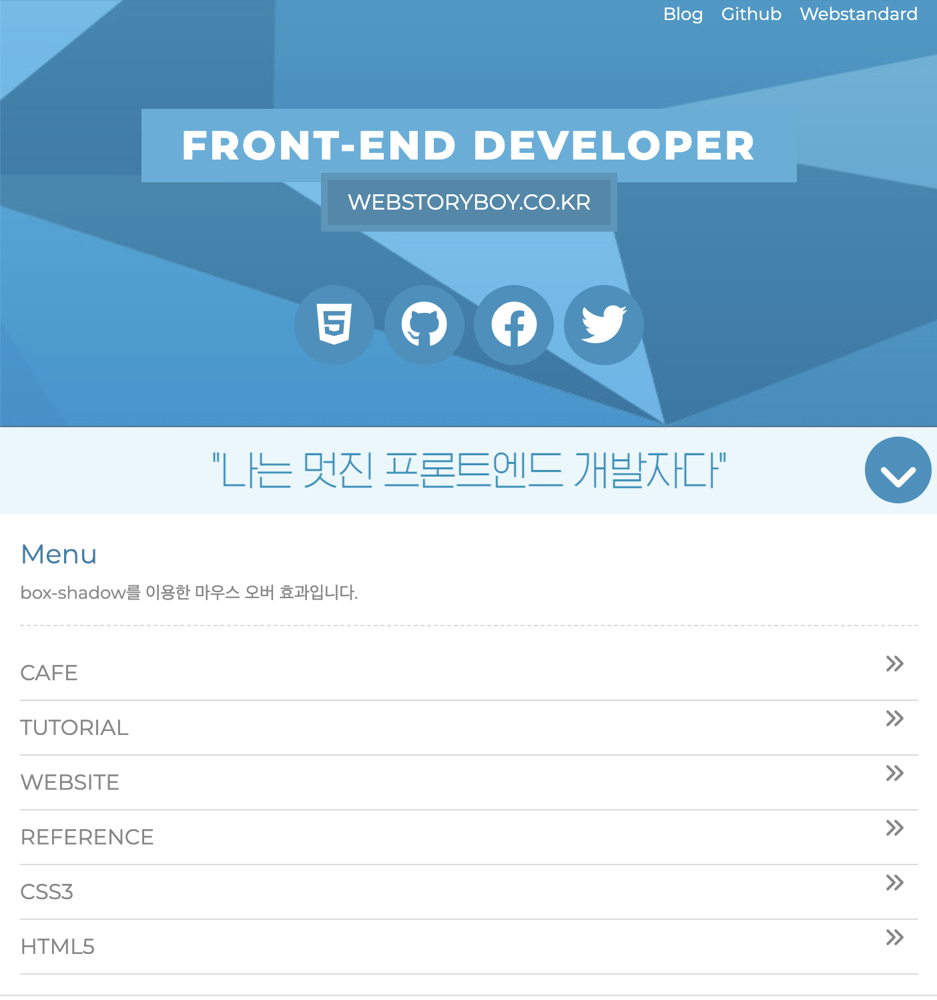
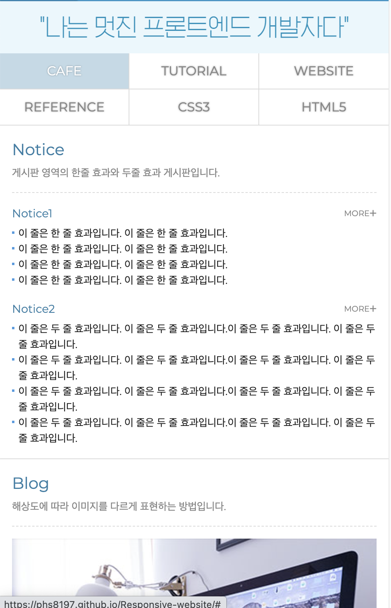

# 반응형 웹사이트 (Responsive website)

   
  
  
  
   

목차

## 반응형을 고려하여 만든 웹사이트입니다.

slick라이브러리를 이용하여 slider를 구현하고. 
메뉴, 헤더, 컨텐츠 영역 등 디자인 작업부터 반응형을 고려하여 작업하였습니다.

 

## 기술 스택

|    html    |     css    |     figma.   |
| :--------: | :--------: | :--------:   |
|  ![html]   |   ![css]   |   ![figma].  |

 

## 구현 기능

### 기능 1
slider 기능 구현  
### 기능 2
lightgallery 라이브러리 이용하여 동적인 이미지갤러리 구현 
### 기능 3
헤더, 메뉴, 게시판영역 반응형 제작 
### 기능 4
3d 애니메이션을 주어 좀 더 부드러운 css 구현
 

 

<!-- Stack Icon Refernces -->
[html]: /img/stack/html.svg
[css]: /img/stack/css.svg
[figma]: /img/stack/figma.svg
[ts]: /image/stack/typescript.svg
[react]: /image/stack/react.svg
[node]: /image/stack/node.svg
